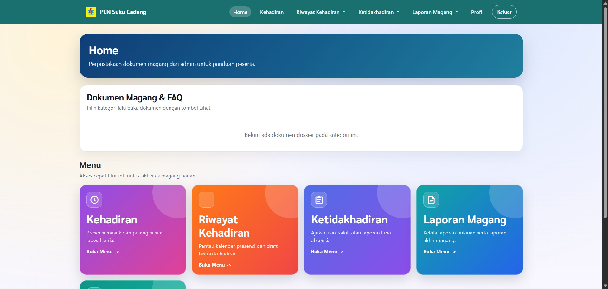
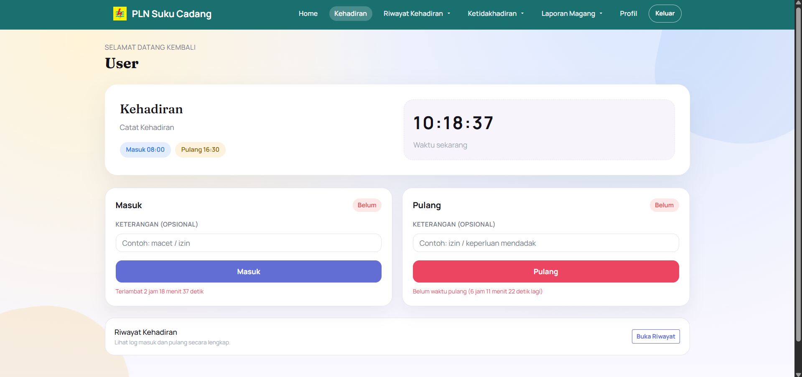
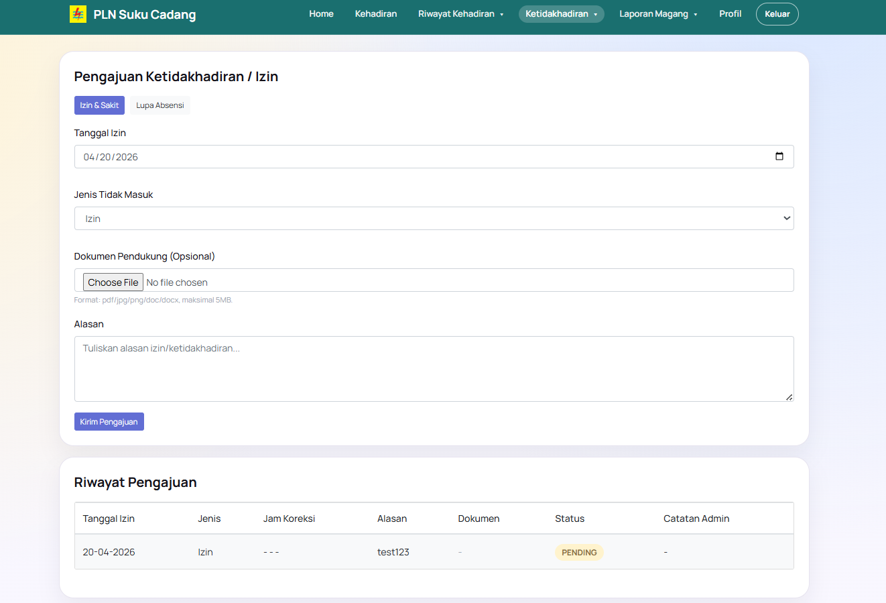
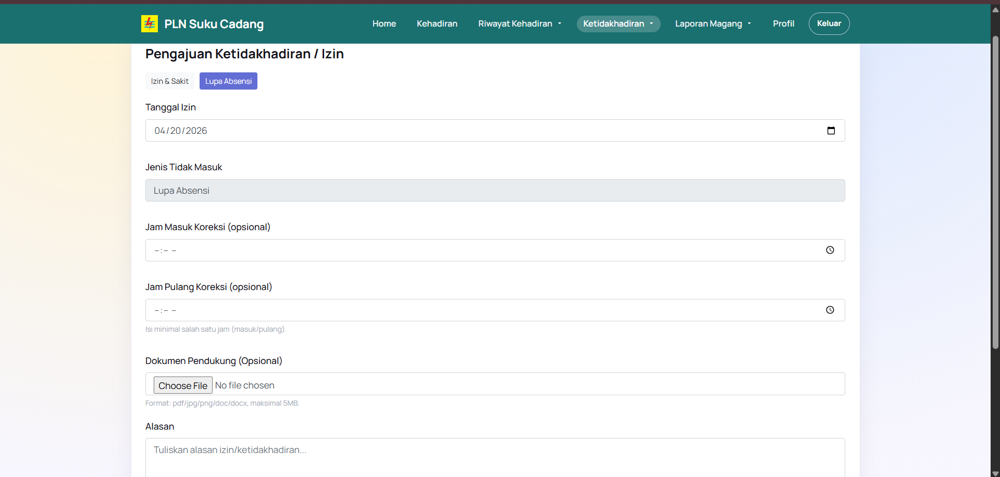

# Sistem Pengelolaan Absensi Peserta Magang - PT PLN Suku Cadang

Sistem Pengelolaan Absensi Peserta Magang PT PLN Suku Cadang adalah aplikasi web berbasis Laravel yang dirancang untuk membantu proses pengelolaan kehadiran peserta magang secara terstruktur. Sistem ini mendukung alur operasional dari pendaftaran magang, pencatatan absensi masuk dan pulang, pengajuan ketidakhadiran, pengelolaan laporan, hingga monitoring data oleh admin.

Proyek ini menyediakan dua area utama:
- `User`: peserta magang untuk melakukan presensi, melihat riwayat, mengajukan izin/sakit/lupa absensi, dan mengelola dokumen.
- `Admin`: pengelola sistem untuk memantau data absensi, memverifikasi pengajuan, mengelola master data, dan memonitor peserta magang.

## Fitur Utama
- Landing page dan form pendaftaran magang online.
- Login terpisah untuk admin dan user.
- Presensi masuk dan pulang peserta magang.
- Kalender riwayat kehadiran bulanan.
- Pengajuan ketidakhadiran:
  - Izin
  - Sakit
  - Lupa absensi
- Pengelolaan laporan:
  - Laporan bulanan
  - Laporan akhir
  - Draft/template dokumen magang
- Dashboard admin untuk monitoring operasional.
- Pengelolaan data master:
  - Peserta magang
  - Divisi
  - Mentor
  - Hari libur nasional
- Rekap dan tampilan data absensi per peserta.

## Teknologi
- Laravel 8
- PHP
- MySQL / MariaDB
- Blade Template
- Bootstrap
- JavaScript
- Laravel Mix

## Tampilan Sistem

### Landing Page
Halaman awal sistem untuk memberikan informasi umum dan akses ke proses pendaftaran magang.


### Login
Halaman autentikasi untuk masuk ke sistem sesuai role pengguna.


---

## Role User

Role user ditujukan untuk peserta magang yang menggunakan sistem dalam aktivitas harian dan pengelolaan dokumen magang.

### 1. Homepage User
Halaman utama user yang menampilkan ringkasan akses cepat ke fitur-fitur penting.



### 2. Absensi Masuk dan Pulang
User dapat melakukan presensi masuk dan pulang sesuai jadwal kerja yang berlaku.



### 3. Kalender Riwayat Absensi User
Riwayat kehadiran user ditampilkan dalam format kalender bulanan agar lebih mudah dibaca.


### 4. Pengajuan Ketidakhadiran
User dapat mengajukan ketidakhadiran untuk kebutuhan administratif.

#### Izin / Sakit


#### Lupa Absensi


### 5. Draft Absensi
Fitur ini digunakan user untuk mengakses draft dokumen absensi yang tersedia.


### 6. Profil User
User dapat melihat dan memperbarui informasi profil yang berkaitan dengan data magang.


---

## Role Admin

Role admin digunakan untuk mengelola keseluruhan sistem, memonitor data peserta, dan memastikan proses administrasi magang berjalan dengan baik.

### 1. Homepage Admin
Dashboard admin menampilkan ringkasan monitoring sistem dan akses ke menu operasional.


### 2. Daftar Peserta Magang
Admin dapat melihat daftar seluruh peserta magang yang terdaftar di sistem.


### 3. Detail Data Peserta
Admin dapat membuka detail lengkap setiap peserta magang.


### 4. Manajemen Data Pendaftar
Fitur untuk mengelola data pendaftar magang yang masuk ke sistem.


### 5. Manajemen Mentor
Admin mengelola data mentor untuk peserta magang.


### 6. Manajemen Divisi
Admin mengelola penamaan dan struktur divisi pada sistem.


### 7. Manajemen Hari Libur
Admin dapat mengelola hari libur nasional yang akan memengaruhi kalender absensi.


### 8. Manajemen Ketidakhadiran
Admin dapat memantau dan mengelola pengajuan ketidakhadiran dari user.


### 9. Manajemen Laporan Bulanan
Admin dapat memantau dan mengelola laporan bulanan peserta magang.


### 10. Manajemen Laporan Akhir
Admin dapat memantau dan mengelola laporan akhir magang peserta.


### 11. Manajemen Dokumen
Admin dapat mengelola dokumen pendukung atau template yang dapat diakses user.


---

## Role Pendaftaran Magang

Bagian ini mencakup alur pendaftaran magang yang terpisah dari fitur inti absensi, tetapi masih terhubung dalam ekosistem sistem.

### 1. Form Pendaftaran Magang
Sistem menyediakan alur pendaftaran magang untuk calon peserta.


### 2. Status Pendaftaran
Calon peserta dapat memantau status pengajuan pendaftaran magang.


---

## Instalasi dan Setup Lokal

### 1. Clone repository
```bash
git clone <repository-url>
cd Sistem_Absensi_PLNSC-main
```

### 2. Install dependency backend dan frontend
```bash
composer install
npm install
```

### 3. Konfigurasi environment
```bash
copy .env.example .env
php artisan key:generate
```

Lalu sesuaikan konfigurasi database pada file `.env`.

### 4. Migrasi dan seeder
```bash
php artisan migrate --seed
```

### 5. Jalankan aplikasi
```bash
php artisan serve
```

Untuk menjalankan asset development:

```bash
npm run dev
```

Untuk build production:

```bash
npm run prod
```

## Akun Default Seeder

Seeder bawaan membuat akun admin berikut:

- Email: `admin@ams.com`
- Password: `admin@ams.com`

## Struktur Hak Akses

### Admin
- Mengelola data peserta magang
- Mengelola divisi dan mentor
- Mengelola hari libur nasional
- Melihat kalender absensi peserta
- Melihat dokumen laporan
- Memantau data pendaftar magang

### User
- Melakukan absensi masuk dan pulang
- Melihat riwayat absensi
- Mengajukan izin, sakit, dan lupa absensi
- Mengelola laporan bulanan dan laporan akhir
- Melihat dokumen/template dari admin
- Mengelola profil

## Catatan
- Endpoint registrasi user masih aktif.
- Fitur reset password belum diaktifkan secara default.
- Gambar dokumentasi README disimpan pada folder `images-readme`.

## Lisensi
MIT License
